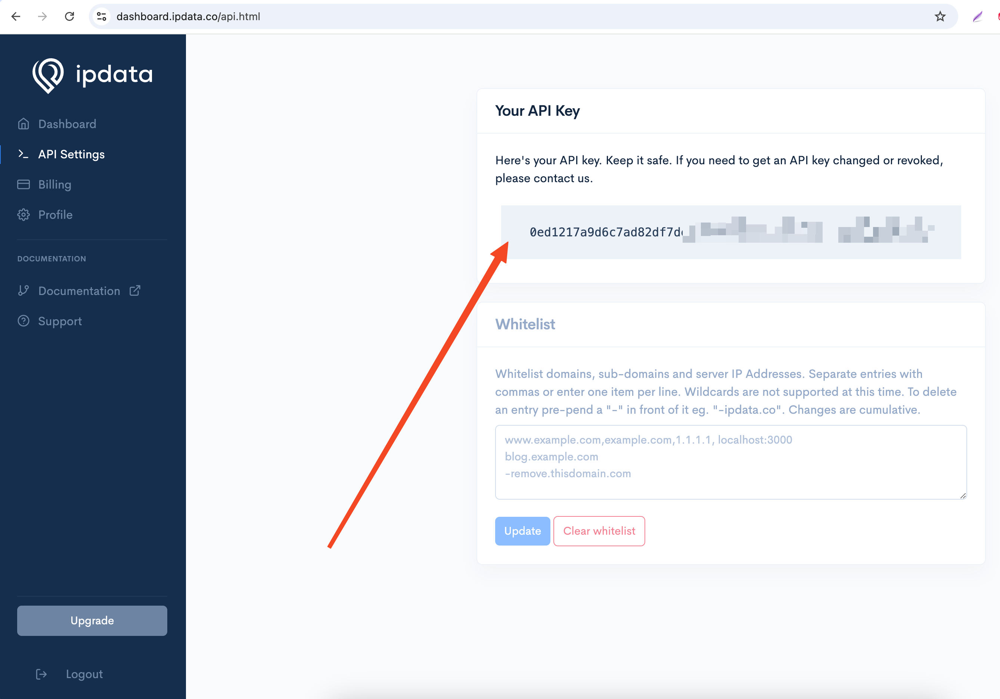
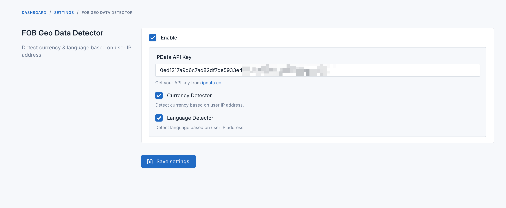

# Geo Data Detector - Auto detect user currency & language based on location (IP)

This plugin will help you to detect user currency & language based on their location (IP). It will automatically detect the user's currency and set it to the session.

## Requirements

-   Dev core 7.3.0 or higher.

## Installation

### Install via Admin Panel

Go to the **Admin Panel** and click on the **Plugins** tab. Click on the "Add new" button, find the **Geo Data Detector** plugin and click on the "Install" button.

### Install manually

1. Download the plugin from the [Laravel Marketplace](https://marketplace.fsofts.com/products/dev/geo-data-detector).
2. Extract the downloaded file and upload the extracted folder to the `dev/plugins` directory.
3. Go to **Admin** > **Plugins** and click on the **Activate** button.

## Usage

- Register an account on https://dashboard.ipdata.co/sign-up.html

- Get API key on https://dashboard.ipdata.co/api.html

- Go to **Admin** > **Settings** > **Geo Data Detector** and set your IPData API key.

- That's it. The plugin will automatically detect the user's currency & language based on their location.

## Changelog

Please see [CHANGELOG](CHANGELOG.md) for more information what has changed recently.

## Contributing

Please see [CONTRIBUTING](CONTRIBUTING.md) for details.

## Security

If you discover any security related issues, please email contact@fsofts.com instead of using the issue tracker.

## Credits

-   [Laravel Technologies](https://github.com/vswb)
-   [All Contributors](../../contributors)

## License

The MIT License (MIT). Please see [License File](LICENSE) for more information.
