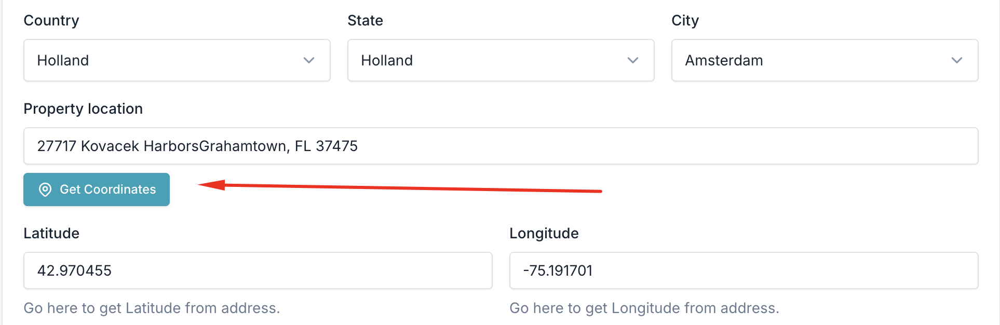
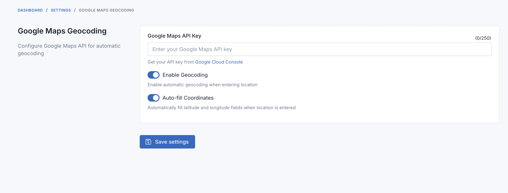

# Google Maps Geocoding Plugin

This plugin adds automatic address suggestions and coordinate generation to your property forms in Laravel CMS.

**Important**: This plugin only works with these Core scripts:
- [Flex Home](https://codecanyon.net/item/flex-home-laravel-real-estate-multilingual-system/25197385) - Real Estate System
- [Jobcy](https://codecanyon.net/item/jobcy-laravel-job-board-multilingual-system/39182056) - Job Board System
- [JobBox](https://codecanyon.net/item/jobbox-laravel-job-portal-multilingual-system/42582644) - Job Portal System
- [Hously](https://codecanyon.net/item/hously-laravel-real-estate-multilingual-system/43805729) - Real Estate System
- [Homzen](https://codecanyon.net/item/homzen-laravel-real-estate-agency-portal-multilingual/52829651) - Real Estate Agency Portal

It does not support other scripts at this time.

## What This Plugin Does

**Address Autocomplete**: When you type an address, it shows suggestions from Google Maps
**Automatic Coordinates**: When you select an address, it automatically fills in the latitude and longitude
**Clean Addresses**: Formats addresses properly using Google's location data
**Works Everywhere**: Covers locations worldwide

## Installation

You can install this plugin in two ways:

**Option 1: From Marketplace (Easiest)**
1. Go to Admin Panel > Plugins > Add new plugins
2. Search for "Google Maps Geocoding"
3. Click Install

**Option 2: Manual Installation**
1. Copy the plugin folder to `dev/plugins/`
2. Go to Admin Panel > Plugins > Installed plugins
3. Find "Google Maps Geocoding" and click Activate

## Setup Google Maps

### Get Your API Key
1. Visit [Google Cloud Console](https://console.cloud.google.com/)
2. Create a new project or select an existing one
3. Enable these APIs:
   - Geocoding API
   - Places API

### Secure Your API Key
1. Create an API Key in Google Cloud Console
2. Restrict it to your website domain (example: yourdomain.com/*)
3. Restrict it to only the APIs you enabled

### Configure the Plugin

1. Go to: Admin Panel > Settings > Others > Google Maps Geocoding

2. Enter your settings:
   - API Key: Paste your Google Maps API key
   - Enable Geocoding: Turn this on
   - Auto-fill Coordinates: Turn this on for automatic coordinate filling

3. Save Settings

## How to Use

When creating or editing a property:

**Using Address Suggestions**
1. Start typing in the "Location" field
2. Select an address from the dropdown list
3. Latitude and longitude will fill in automatically

**Typing Your Own Address**
1. Type your complete address
2. Click outside the field or press Tab
3. Coordinates will fill automatically (if auto-fill is enabled)
4. Or click "Get Coordinates" button to manually fetch them

## Requirements

**System Requirements**
- Laravel CMS version 7.5.0 or higher
- Internet connection
- Modern web browser

**Google Requirements**
- Google Cloud Account (free tier available)
- Google Maps API Key with these APIs enabled:
  - Geocoding API
  - Places API

**Browser Support**
Works on all modern browsers including Chrome, Firefox, Safari, Edge, and mobile browsers.

## Troubleshooting

**"API request denied" Error**
- Check your API key in Google Cloud Console
- Make sure Geocoding and Places APIs are enabled
- Verify your domain is in the allowed list

**"Quota exceeded" Error**
- You've reached your API usage limit
- Check usage in Google Cloud Console
- Consider upgrading your Google Cloud plan

**Autocomplete Not Working**
- Make sure Places API is enabled
- Clear your browser cache
- Check if the plugin is activated

**Coordinates Not Filling**
- Check if "Auto-fill Coordinates" is enabled in settings
- Verify Geocoding API is enabled
- Try using the "Get Coordinates" button

## Frequently Asked Questions

**Does this work with forms other than property forms?**
Currently designed for property forms, but can be customized for other forms.

**Do I need internet connection?**
Yes, the plugin requires internet to connect to Google Maps.

**Can I use my existing Google Maps API key?**
Yes, just make sure Geocoding and Places APIs are enabled.

**Is there a usage limit?**
Google Maps has free monthly quotas. After that, they charge per request.

**Does it work in multiple languages?**
Yes, Google automatically shows results in your browser's language.

## Support

Need help? Report bugs or request features on our GitHub page.

## License

This plugin is open-source software licensed under the MIT License.

## Credits

Developed by [Laravel Technologies](https://fsofts.com) for [Laravel CMS](https://fsofts.com)
