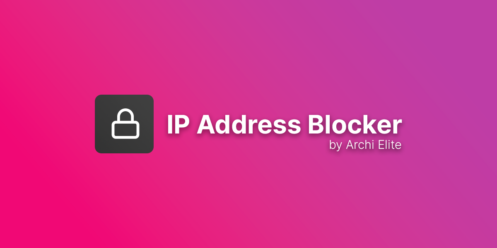

# Laravel Platform IP Blocker

IP Blocker is a plugin for Laravel CMS that allows you to restrict user access via IP.

## Requirements

- Platform core 6.5.5 or higher.

## Installation

**Install via Admin Panel**

Go to the **Admin Panel** and click on the **Plugins** tab. Click on the "Add new" button, find the **IP Blocker** plugin and click on the "Install" button.

**Install manually**

1. Download the plugin from the [Laravel CMS Platform Marketplace](https://marketplace.fsofts.com/products/archielite/dev-ip-blocker).
2. Extract the downloaded file and upload the extracted folder to the `dev/plugins` directory.
3. Go to **Admin** > **Plugins** and click on the **Activate** button.

## Usage

- Please create some redirection rules in Admin > Settings > IP Blocker

- The 403 error page appears when IP address has been blocked from accessing the website.

## Contributing

Please see [CONTRIBUTING](CONTRIBUTING.md) for details.

## Security

If you discover any security-related issues, please email dev@fsofts.com instead of using the issue tracker.

## Credits

-   [Laravel Technologies](https://github.com/archielite)
-   [All Contributors](../../contributors)

## License

The MIT License (MIT). Please see [License File](LICENSE) for more information.