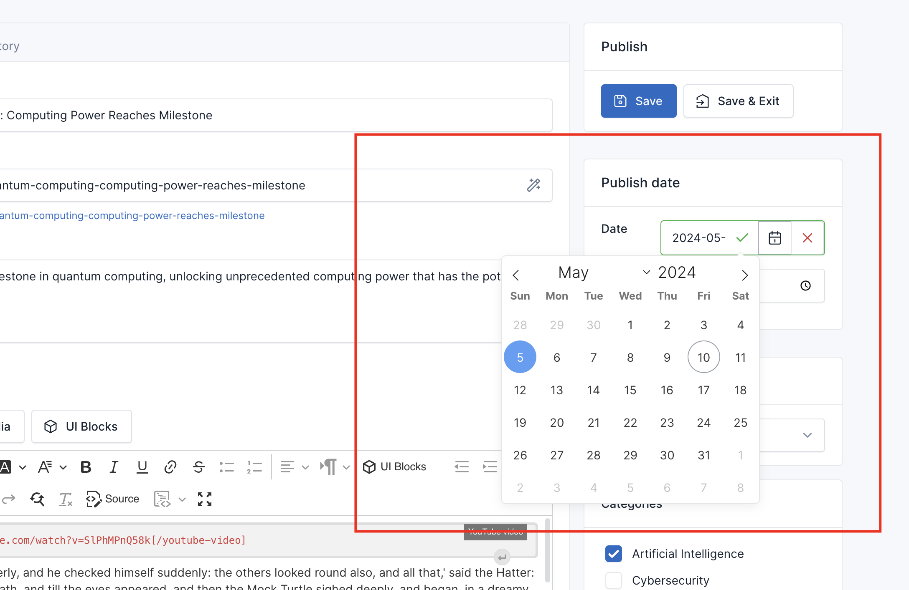

# Overview
This is a plugin for Laravel CMS so you have to purchase Laravel CMS first to use this plugin. 
Purchase it here: [https://cms.fsofts.com](https://cms.fsofts.com)

Post Scheduler is a plugin that allows you to modify the created time of posts.

# Installation

## Install via Admin Panel

Go to the **Admin Panel** and click on the **Plugins** tab. Click on the "Add new" button, find the **Post Scheduler**
plugin and click on the "Install" button.

## Install manually

1. Download the plugin from
   the [Laravel Marketplace](https://marketplace.cms.fsofts.com/products/vswb/post-scheduler).
2. Extract the downloaded file and upload the extracted folder to the `dev/plugins` directory.
3. Go to **Admin** > **Plugins** and click on the **Activate** button.

# Contact us
- Website: [https://cms.fsofts.com](https://cms.fsofts.com)
- Email: [contact@fsofts.com](mailto:contact@fsofts.com)
