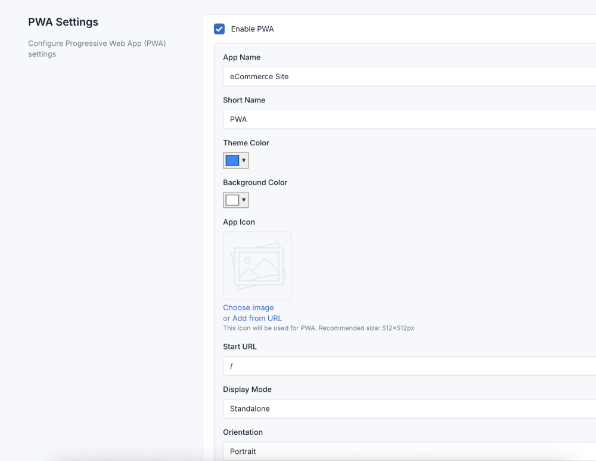

# PWA Support

This is a plugin for Laravel CMS that adds Progressive Web App (PWA) support to any theme.

## Requirements

- Core Core 7.3.0 or higher
- PHP 8.1 or higher

## Installation

1. Download the plugin
2. Extract to `dev/plugins/pwa`
3. Go to Admin -> Plugins and activate "PWA Support"
4. Go to Settings -> PWA to configure your Progressive Web App

## Features

- Add PWA support to any theme
- Customizable PWA settings
- Service worker for offline functionality
- Automatic PWA icon generation from site logo
- Manifest.json generation based on settings

## Usage

1. Go to Settings -> PWA in the admin panel
2. Enable PWA support
3. Configure your PWA settings:
   - App name and short name
   - Theme color and background color
   - App icon (uses site logo by default)
   - Display mode and orientation

## Contributing

Please see [CONTRIBUTING](CONTRIBUTING.md) for details.

## Security

If you discover any security related issues, please email contact@fsofts.com instead of using the issue tracker.

## Credits

- [Laravel Technologies](https://github.com/vswb)
- [All Contributors](../../contributors)

## License

The MIT License (MIT). Please see [License File](LICENSE) for more information.
