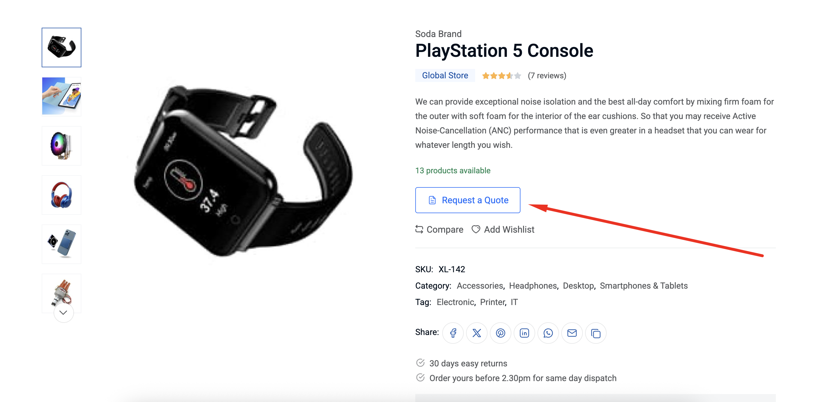
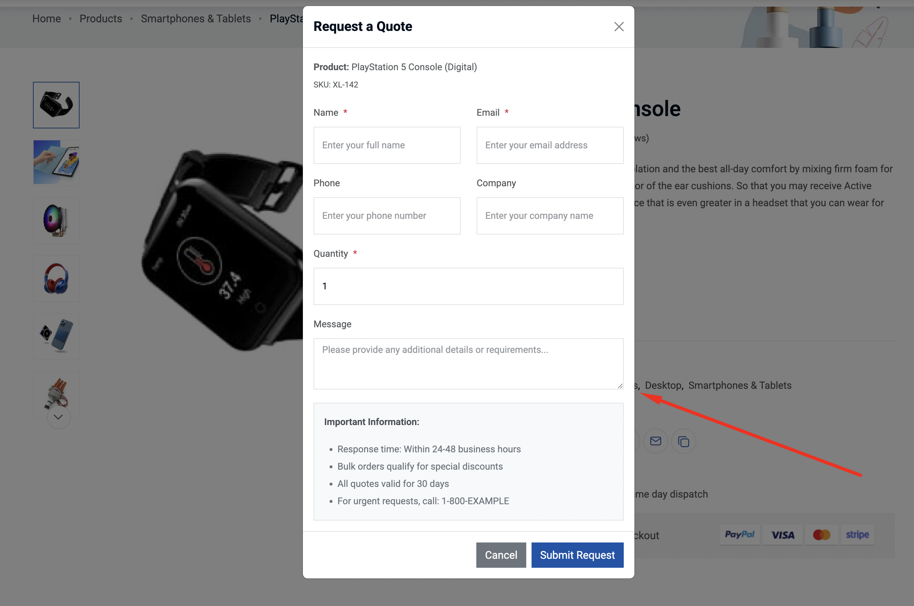
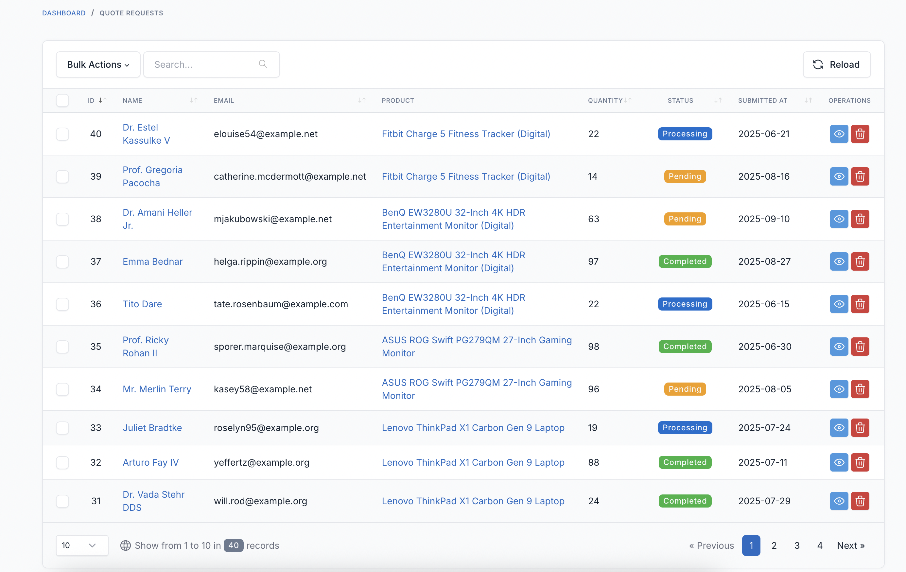
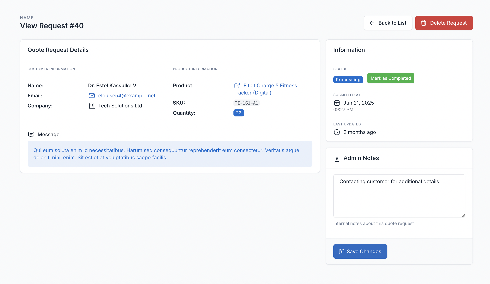
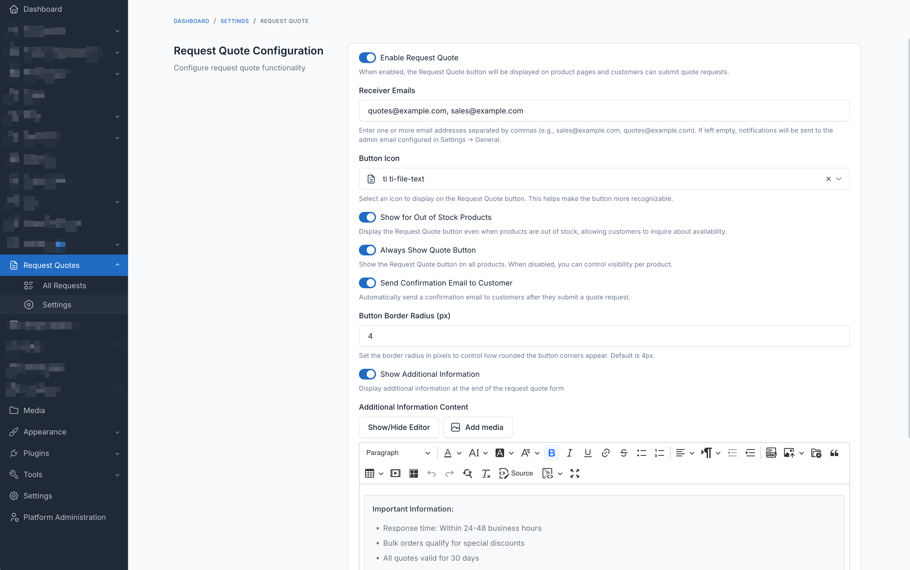

# Request Quote

A comprehensive quote request plugin for Laravel CMS that enables customers to request product quotes through a user-friendly form, while providing administrators with powerful tools to manage and respond to these inquiries efficiently.

## Requirements

- Dev core 7.5.0 or higher.
- PHP 8.1 or higher.

## Installation

### Install via Admin Panel

Go to the **Admin Panel** and click on the **Plugins** tab. Click on the "Add new" button, find the **Request Quote** plugin and click on the "Install" button.

### Install manually

1. Download the plugin from the [Laravel Marketplace](https://marketplace.fsofts.com/products/dev/request-quote).
2. Extract the downloaded file and upload the extracted folder to the `dev/plugins` directory.
3. Go to **Admin** > **Plugins** and click on the **Activate** button.

## Features

- **Quote Request Form**: Modal-based form with comprehensive validation for customer inquiries
- **Product Integration**: Seamlessly integrates with existing product pages with customizable button placement
- **Email Notifications**: Automated notifications for both administrators and customers
- **Status Management**: Track quotes through Pending, Processing, and Completed stages
- **Admin Dashboard**: Centralized management interface for all quote requests
- **Customizable Settings**: Configure button appearance, email recipients, and display rules
- **Form Validation**: Advanced email and phone number validation using Core's built-in rules
- **Multi-language Support**: Fully translatable for international stores
- **Additional Information**: Display custom messages or terms in the quote form
- **Responsive Design**: Works perfectly on desktop, tablet, and mobile devices

## Usage

### For Store Administrators

1. Navigate to **Admin** > **Request Quotes** to view all quote requests
2. Click on any quote to view detailed information
3. Update status and add internal notes as needed
4. Configure settings at **Admin** > **Request Quotes** > **Settings**

### For Customers

1. Visit any product page
2. Click the "Request a Quote" button
3. Fill in the required information
4. Submit the form and receive a confirmation email

### Configuration Options

Access settings at **Admin** > **Request Quotes** > **Settings**:

- **Enable/Disable**: Control global visibility of quote request feature
- **Receiver Emails**: Set multiple email addresses for notifications
- **Button Customization**: Choose icon and adjust border radius
- **Display Rules**: Show for out-of-stock products or all products
- **Email Settings**: Enable/disable customer confirmation emails
- **Additional Information**: Add custom content to the quote form

## Screenshots

## Contributing

Please see [CONTRIBUTING](CONTRIBUTING.md) for details.

## Bug Reports

If you discover a bug in this plugin, please [create an issue](https://github.com/vswb/request-quote/issues).

## Security

If you discover any security related issues, please email contact@fsofts.com instead of using the issue tracker.

## Credits

- [Laravel Technologies](https://github.com/vswb)
- [All Contributors](../../contributors)

## License

The MIT License (MIT). Please see [License File](LICENSE) for more information.
